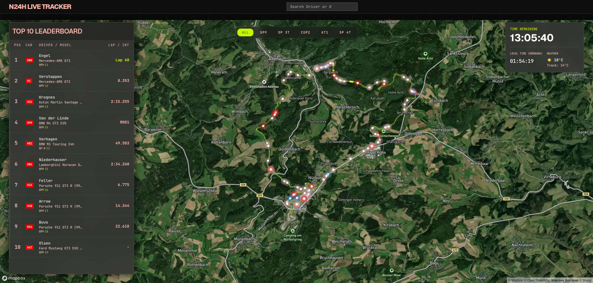

# N24H Live Tracker - Green Hell



*Read this in [Portuguese / Leia em Português](#português)*

A professional, real-time live tracking telemetry dashboard for the **Nürburgring 24h (N24)** endurance race. 

This system connects directly to the official Live Timing Azure WebSocket feed, interpolates vehicle telemetry in a lightweight backend, and renders smooth, highly tactical real-time car positions along the 25.3km Nordschleife circuit using Mapbox and React.

## 🚀 Features
- **Real-Time Map Interpolation**: Calculates vehicle movement between sectors based on instantaneous radar speeds, offering smooth position tracking without ghosting.
- **Dynamic Leaderboard**: Alternating live data (every 20s) showing Gaps, Intervals, Last Lap Times, and Real-Time Driver/Model information.
- **Code 60 Detection Engine**: A heuristical mathematical backend engine that dynamically detects when a track sector enters a 'Code 60' slow-zone and overlays a warning layer on the UI map.
- **Pit-Stop & Incident Detection**: Intelligent tracking that identifies if a car is entering the pit lane or if it has crashed/stopped on the track, updating UI badges accordingly.
- **Premium UI/UX Aesthetics**: Features a Glassmorphism design system built with TailwindCSS, tailored to look like a multi-million-dollar tactical endurance race command center.

## 🎥 Demo
<video src="docs/N24H-LIVE-TRACKER---GREEN-HELL.webm" controls="controls" muted="muted" width="100%"></video>

## 🛠️ Tech Stack
- **Backend**: Node.js, Socket.io (WebSocket), Turf.js (Geospatial logic).
- **Frontend**: React, Vite, Tailwind CSS, React-Map-GL (Mapbox).

## 📦 How to Run

1. **Install dependencies:**
```bash
# Backend
cd backend
npm install

# Frontend
cd frontend
npm install
```

2. **Start the services:**
```bash
# Start Backend on port 3001
cd backend
node src/index.js

# Start Frontend (Vite)
cd frontend
npm run dev
```

3. **Replay Mode (Optional):**
If you want to simulate the race using recorded telemetry files (useful for post-race reviewing or debugging), set the following environment variables when starting the backend:
```bash
cd backend
REPLAY_MODE=true REPLAY_FILE=replay_window_0000_0130.jsonl.gz node src/index.js
```
*Note: Make sure your compressed `.jsonl.gz` telemetry files are placed inside the `backend/replays/` folder.*

---

<br/>

<h1 id="português">N24H Live Tracker - Green Hell (PT-BR)</h1>

Um painel profissional de telemetria e rastreamento em tempo real para a corrida de longa duração **Nürburgring 24h (N24)**.

Este sistema se conecta diretamente ao WebSocket oficial da Azure (Live Timing), interpola a telemetria dos veículos através de um backend otimizado, e renderiza as posições de forma suave e tática ao longo dos 25,3 km do circuito de Nordschleife utilizando Mapbox e React.

## 🚀 Funcionalidades
- **Interpolação de Mapa em Tempo Real**: Calcula a movimentação entre setores com base na velocidade de radar registrada, oferecendo um rastreamento suave.
- **Leaderboard Dinâmico**: Alternância automática de dados a cada 20 segundos para exibir *Gaps*, *Intervals*, tempos de última volta e modelo do carro em tempo real.
- **Motor de Detecção Code 60**: Uma heurística no backend que identifica automaticamente as zonas da pista em "Code 60" e sobrepõe uma linha tracejada amarela no traçado do frontend.
- **Detecção de Acidentes e Pit-Stops**: Rastreamento inteligente capaz de determinar se o carro entrou no box ou se ele quebrou na pista (evitando falsos positivos ou travamento do mapa).
- **Design de Interface Premium**: UI construída com TailwindCSS no estilo Glassmorphism, desenhado para parecer um painel tático avançado de uma equipe de corrida profissional.

## 🎥 Demonstração
<video src="docs/N24H-LIVE-TRACKER---GREEN-HELL.webm" controls="controls" muted="muted" width="100%"></video>

## 🛠️ Tecnologias
- **Backend**: Node.js, Socket.io (WebSocket), Turf.js (Lógica Geoespacial).
- **Frontend**: React, Vite, Tailwind CSS, React-Map-GL (Mapbox).

## 📦 Como Rodar

1. **Instale as dependências:**
```bash
# Backend
cd backend
npm install

# Frontend
cd frontend
npm install
```

2. **Inicie os serviços:**
```bash
# Iniciar Backend na porta 3001
cd backend
node src/index.js

# Iniciar Frontend (Vite)
cd frontend
npm run dev
```

3. **Modo Replay (Opcional):**
Se você deseja simular a corrida usando arquivos de telemetria gravados (útil para revisar a corrida ou testar localmente), defina as seguintes variáveis de ambiente ao iniciar o backend:
```bash
cd backend
REPLAY_MODE=true REPLAY_FILE=replay_window_0000_0130.jsonl.gz node src/index.js
```
*Nota: Certifique-se de que seus arquivos `.jsonl.gz` comprimidos estejam na pasta `backend/replays/`.*
